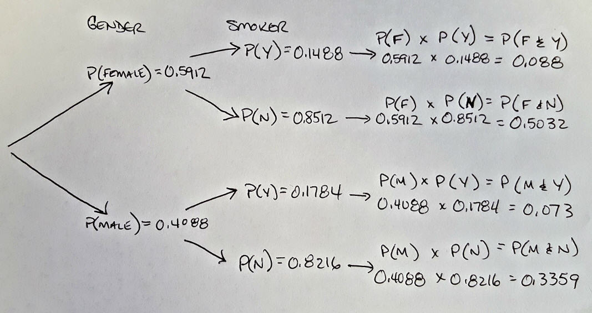

## Behavioral Risk Factor Surveillance System (BRFSS)

The BRFSS is a collection of health related telephone surveys conducted annually.  The BRFSS boasts an annual collection of 400,000 surveys performed each year on a wide variety of health issues and risk behaviors on adult U.S. residents.  The data is collected from all 50 states along with the District of Columbia.

The data for several years can be found online at the Centers for Disease Control (CDC) website.  For this project we are using the 2013 data set found [here](http://www.cdc.gov/brfss/annual_data/annual_2013.html).

The collection methods are based on telephone numbers and the estimate that 97.5% of U.S. households had telephone service in 2012.  This takes into account that many households have moved from having a landline to being covered by cellular phones.  The BRFSS also takes into account a weighting method to handle groups that are underrepresented in the survey.  The details for weighting and sampling methods can be found in [this overview document](https://www.cdc.gov/brfss/annual_data/2013/pdf/overview_2013.pdf).

Because of the level of effort in the annual survey to account for biases, this survey can be generalized to the entire population of the United States.

## Initial setup requirements

Set the enivronments, load all of the necessary libraries and load the full data set.  In the interest of full disclosure, I will be echoing all of my code chunks, even ones that I might normally hide.  This will make for a slightly messier analysis project.

I am using the ggplot2 library to plot some graphs.  I am using dplyr and reshape2 to filter and pivot my results sets.

```{r set-environment, message=FALSE}
setwd('C:/Development/R Projects/Duke/IntroProbData/Course Project')

library(ggplot2)
library(dplyr)
library(reshape2)

load("brfss2013.RData")
```

* * *

## Part 1: Data

The 2013 survey contains a collection of 491775 respondents with 330 facts.  I am loading the entire data set, but as you will be able to see in my question specific data manipulation, I will be limiting to a subset of the data.  I will be echoing all data manipulation commands used in my analysis.

* * *

## Part 2: Research questions

**Question 1: Does the amount of sleep have any correlation to the general feeling of wellness?**

**Question 2: Are there any correlations between income and receiving flu shots?**

**Question 3: Given that a random survey respondent is a woman, what is the percentage that the respondent smokes?**


* * *

## Exploratory data analysis 

**Research question 1:**

This survey includes a question about how the respondents feel in general.  I wondered if there is any relationship between getting a good night's sleep and how people responded about their health. Is there any difference between genders?  For this question, I did some research and found that the National Sleep Foundation recommends that adults get between 7 and 9 hours of sleep per night.  This is what I will call an "Average" night's sleep for my research.

The first thing that I am doing is creating a clean data set of just two facts: the general health status and the sleep time.  I am cleaning the data by removing all records that have NA for either column.  I am also removing all records that have a sleep time greater than 24 (there were 2).  These have been removed because they are obviously erroneous.  It also seems implausible that records with 0 or 24 hours daily are valid, but I do not have enough information to make a determination on them.  I am choosing to leave them in my data set.

```{r}
sleepANDhealth <-
  brfss2013 %>%
    filter(!is.na(genhlth)) %>%
    filter(!is.na(sleptim1)) %>%
    filter(!is.na(sex)) %>%
    filter(sleptim1 <= 24) %>%
    select(sex, genhlth, sleptim1)
```

Running some functions on my new sleepANDhealth data set provides me with the some information about the sleep time.  The sleep time (in hours) of the respondents has a median of 7, a mean of 7.051 and standard deviation of 1.464587.

```{r}
summary(sleepANDhealth$sleptim1)
sd(sleepANDhealth$sleptim1)
```

Plotting a histogram of the sleep time provides a nearly normal distribution, that is slightly skewed right.

```{r q1histogram}
hist(sleepANDhealth$sleptim1, main = "Histogram of Sleep Time", xlab = "Sleep Time (in hours)")
```

The National sleep foundation recommends that adults get between 7 and 9 hours of sleep each day.

Looking over the histogram of sleep times from the survey respondents, I can see that it matches up with the recommendation from the National Sleep Foundation.  Because of this, I am going to create categories for the sleep time as follows (using the recommended sleep times and the standard deviation as a basis for my categories):

Hours of Sleep | Category
-------------- | -------------
0 through 4 | Significantly sleep deprived
5 and 6 | Sleep deprived
7 through 9 | Average sleep
10 and 11 | Oversleeping
12 through 24 | Significant oversleeping

I am using the mutate function to create a new column that will identify each respondent in a category.  I am then further mutating to come up with a percentages representing a grouping by sleep category, sex and health.  It is this column that will be used to generate the graphs.

```{r q1categories}
levels <- c(-Inf, 5, 6.8, 9.8, 11.8, Inf)
labels <- c("0-4", "5-6", "7-9", "10-11", "12-24")

sleepANDhealth <- sleepANDhealth %>% 
  mutate(sleepcat = cut(sleptim1, levels, labels = labels))

sleepANDhealthgroups <- sleepANDhealth %>%
  count(sleepcat, sex, genhlth) %>%
    mutate(catpercent = n / sum(n))
```


```{r q1results}
ggplot(sleepANDhealthgroups, aes(x=sleepcat, y=catpercent, fill = genhlth)) +
  geom_bar(stat="identity") + facet_wrap(~ sex, ncol=2) +
  xlab("Sleep Category") + ylab("Percent") + labs(fill="General Health")
  

```

**Question 1 conclusion:**

Based on the chart above, there does appear to be a correlation between sleep times and the general feeling of health.  As you can see, the "7-9" (Average) category (which is the recommending sleep times) has the highest amount of people who rated themselves in good health or better.  As people had more or less sleep than recommended, they were more likely to rate themselves as fair or poor health.  There are some slight but not significant differences between males and females.  

What cannot be concluded here is whether getting the recommended sleep improves health or if better health improves sleep times.  That is, while there may be correlation between the two variables, I do not have enough information to determine causation.

**Research question 2:**

Does income influence whether someone will get a flu shot?

There are common perceptions that people with higher incomes have more access to health care.  Does the survey support this assumption when it comes to a preventitive flu shot?

Let's start by doing some analysis on incomes in order to better understand our data set.  The INCOME2 column contains a factor variable that already categorizes the survey taker into 8 bins.  I will the factor levels that they have provided and filter out any responders with the values missing.  


```{r q2income}
incomeANDflu <-
  brfss2013 %>%
    filter(!is.na(income2)) %>%
    filter(!is.na(flushot6)) %>%
    filter(flushot6 == 'Yes' | flushot6 == 'No') %>%
    select(income2, flushot6)

summary(incomeANDflu$income2)
summary(incomeANDflu$flushot6)

incomeANDflugroups <-
  incomeANDflu %>%
      filter() %>%
      group_by(income2, flushot6) %>% 
      summarise(count = n())

```


```{r q2pivot}

incomeANDflugroups <- dcast(incomeANDflugroups, income2 ~ flushot6, value.var = "count")
incomeANDflugroups <- incomeANDflugroups %>%
  mutate(yespercent = Yes / (Yes + No))
incomeANDflugroups
```

Finally, I can plot a bar plot showing the relation between income and flu shots.

```{r q2plot}
ggplot(data=incomeANDflugroups, aes(x=income2, y=yespercent)) +
        ggtitle("Flu Shots Based on Income") +
        labs(x="Income Category",y="Percent Receiving Flu Shots") +  
        theme(axis.text.x = element_text(face="bold", color="#0000FF", size=10, angle=45)) +
        geom_bar(colour="black", fill="#FF0000", stat="identity");
```

**Question 2 conclusion:**

I found from my research here that there is a signficant difference between income levels when reviewing the likelihood of receiving a flu shot.  As the income rises, the person is more likely to have been given a flu shot.  The 36% of the lowest income category had received flu shots, while 50% of the highest income group had received them.  If I had more time to investigate, it would be interesting to try and determine why there is such a difference.

**Research question 3:**

If I choose a random survey respondent who smokes, what is the probability of the respondent being a female?

The answer to this question is interesting to me because of the people that I know who are smokers, a large portion of them are women.

I will create another new data set for my data analysis.  This one is also dependent upon three variables, gender, smoke100 and smokday2.  I am going to remove all records that do not have the gender selected (this removes 7 records).  Determining whether someone is a smoker and that we have valid data is a little more complicated.  The SMOKE100 column indicates whether someone has smoked 100 cigarettes in their lifetime.  Values other than 1 or 2 have no meaning in my analysis and so I will filter them out.

The data related to smoking is a little bit confusing.  So I am outlining the decisions that I have made on how to interpret the data.

smoke100 | smokday2 | Smoker 
-------------- | ------------- | -------------
7, 9 and NA | Any Value | Can't determine, these will be discarded
2 | Any value | Not a smoker
1 | 7, 9 and NA | Can't determine, these will be discarded
1 | 3 | No, these are former smokers.
1 | 1 and 2 | Yes

Once these filters are in place, we are left with a total of 476442 records.  

```{r q3filtering}

genderANDsmoking <-
  brfss2013 %>%
    filter(!is.na(sex)) %>%
    filter(!is.na(smoke100)) %>%
    filter(smoke100 == 'Yes' & !is.na(smokday2) | smoke100 == 'No') %>%
    select(sex, smoke100, smokday2)

genderANDsmoking <- genderANDsmoking %>%
    mutate(smoker = smoke100 == 'Yes' & smokday2 %in% c('Every day','Some days'))

genderANDsmoking %>%
    filter() %>%
    group_by(sex, smoke100, smokday2, smoker) %>% 
    summarise(count = n())
```

Now that I have a clean dataset, with the identification of smoking status in the new smoker column, I can do some analysis on the dataset.  

```{r q3summaries}
genderANDsmoking %>%
    filter() %>%
    group_by(sex) %>% 
    summarise(count = n())

genderANDsmoking %>%
    filter() %>%
    group_by(sex, smoker) %>% 
    summarise(count = n())
```

To help determine the answer, I decided to use a probability tree and have inserted my drawing of the tree here.  



From my drawing above, I can begin doing my calculation using the Bayes algorithm.

\[
\begin{eqnarray}
P(Female~|~Smoker) & = & \frac{P(Female~and~Smoker)}{P(Smoker)}\\
& = & \frac{0.088}{0.088~+~0.073}\\
& = & 0.5466
\end{eqnarray}
\]

**Question 3 conclusion:**

In conclusion, if a randomly selected respondent is a smoker, there is approximately 55% chance that the respondent is female.

## Appendix A - Code Book

I am listing a subset of the code book, describing only the columns that I used in my analysis.  It would be impractical to include the entire code book in this Appendix.

Health Status
Variable Name: GENHLTH
Description: Would you say that in general your health is:
Value | Value Label
1 | Excellent
2 | Very good
3 | Good
4 | Fair
5 | Poor
7 | Don't know/Not sure
9 | Refused
BLANK | Not asked or Missing

Inadequate Sleep
Variable Name: SLEPTIM1
Description: How Much Time Do You Sleep?
Value | Value Label
1 - 24 | Number of hours [1-24]
77 | Don't know/Not Sure
99 | Refused 

Income Level 
Variable Name: INCOME2
Description: Is your income from all sources
Value | Value Label 
1 | Less than $10,000
2 | Less than $15,000 ($10,000 to less than $15,000)
3 | Less than $20,000 ($15,000 to less than $20,000)
4 | Less than $25,000 ($20,000 to less than $25,000)
5 | Less than $35,000 ($25,000 to less than $35,000)
6 | Less than $50,000 ($35,000 to less than $50,000)
7 | Less than $75,000 ($50,000 to less than $75,000)
8 | $75,000 or more
77 | Don't know/Not sure
99 | Not asked or missing

Respondents Sex
Variable Name: SEX
Description: Indicate sex of respondent.
Value | Value Label 
1 | Male
2 | Female

Adult flu shot/spray past 12 months
Variable Name: FLUSHOT6
Description: During the past 12 months, have you had either a flu shot or a flu vaccine that was sprayed in your nose?
Value | Value Label
1 | Yes
2 | No
7 | Don't know/Not sure
9 | Refused
BLANK | Not asked or missing

Smoked at leastr 100 cigarettes
Variable Name: SMOKE100
Description: Have you smoked at least 100 cigarettes in your entire life?
Value | Value Label
1 | Yes
2 | No
7 | Don't know/Not sure
9 | Refused
BLANK | Not asked or missing

Frequency of Days Not Smoking
Variable Name: SMOKDAY2
Description: Do you now smoke cigarettes every day, some days, or not at all?
Value | Value Label
1 | Every Day
2 | Some days
3 | Not at all
7 | Don't know/Not sure
9 | Refused
BLANK | Not asked or missing


The complete code book is found on the CDC website [here]:(http://www.cdc.gov/brfss/annual_data/2013/pdf/codebook13_llcp.pdf)